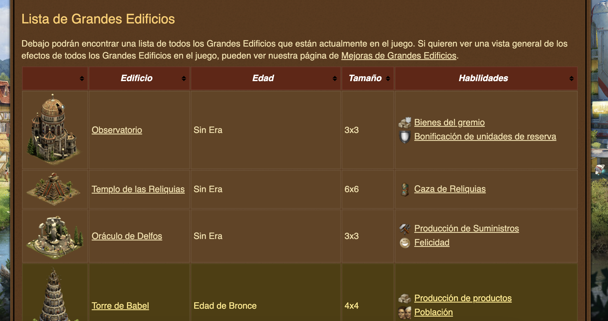

## Table of Contents

1. [Introduction](#Introduction)
2. [Data Acquisition](#Data_Acquisition)
3. [Collection Of The Data Related To The Buildings](#Collection_Of_The_Data_Related_To_The_Buildings)
4. [Obtaining The Data Related To The Levels Of Each Of The Buildings](#Obtaining_The_Data_Related_To_The_Levels_Of_Each_Of_The_Buildings)
5. [Additional Data Included](#Additional_Data_Included)
6. [Datasets](#Datasets)
7. [Structure Of Csv Files](#Structure_Of_Csv_Files)
8. [Allbuildinglevels Csv](#Allbuildinglevels_Csv)
9. [Buildingsinfo Csv](#Buildingsinfo_Csv)
10. [Buildingname Csv](#Buildingname_Csv)


# Introduction <a name="Introduction"></a>

The main objective of this repository is to provide the data related to the existing large buildings in the game [Forge Of Empires](https://es0.forgeofempires.com/page/), in addition to the specific data of forge points for each of the levels of these buildings.

The acquisition of this data has been carried out by performing web scrapping on the fps calculation tool "[FOE Tools](https://foe.tools/es)" (to obtain the specific information of the levels of each great building), and from the "[Forge Of Empires Wiki](https://es.wiki.forgeofempires.com/index.php?title=Grandes_Edificios)" (to obtain the data of each great building).
# Data Acquisition <a name="Data_Acquisition"></a>
## Collection of the data related to the buildings <a name="Collection_Of_The_Data_Related_To_The_Buildings"></a>

[The Forge of Empires wiki website](https://es.wiki.forgeofempires.com/index.php?title=Grandes_Edificios) has been used to obtain the data of the buildings. The process has been carried out by taking the source code of the web and using the Pandas library to transform the web table where the data were found (See Figure 1), to a DataFrame object on which to preprocess the data and save them in a .csv file.


**Figure 1: Forge of Empires Wiki.**


The source code for this step can be found in the notebook **code/getBuildingData.ipynb**.

## Obtaining the data related to the levels of each of the buildings <a name="Obtaining_The_Data_Related_To_The_Levels_Of_Each_Of_The_Buildings"></a>

In the case of building level data, the [FOE Tools](https://foe.tools/es) was used.

The first step has been to obtain the url for each of the great buildings, in order to obtain the data related to all their levels. For this purpose, an existing *dropdown* element has been used in the page in which the name of each building appears, as well as the value used by the page to generate the url to the corresponding data (See Figure 2). This allows us to obtain both the name of the building and the reference needed to generate the url and access its data.


**Figure 2: Obtained url from Great Buildings.**

Once we have obtained this data and verified that all the urls to each building received a *status_code = 200*, we can be sure that the obtaining of these references has been done correctly and now we only need to obtain the data for each level.

To obtain the data for each level, the first step is to access the url of each building. Within this page we find a form in which, by establishing the level of the building, a table is updated with the data related to that level. Due to the fact that the maximum level of each building is not known with certainty at the beginning, the *min* and *max* attributes existing in the level input have been used (See Figure 3). This makes it possible to perform iterations from 0 to the maximum value of levels of that building, and to obtain the data related to it.


**Figure 3: Obtained min level and max level of building.**

Since the table always has the same format (See Figure 4), it is simple to determine in which cells the values we are interested in are located in order to keep them.


**Figure 4: Table with level data.**

This process is repeated for each of the building levels. Once a building is finished, a dataset with the data of all levels is generated and stored in a .csv file (separated by ;) with the format *buildingName.csv*.

Finally, this step is repeated for each of the great buildings obtained in the first step of this subsection.

The source code for this step can be found in the notebook **code/getBuildingLevels.ipynb**

## Additional data included <a name="Additional_Data_Included"></a>

In order to improve the data obtained, some additional fields have been added to the data obtained from the different sources mentioned above:

* In the case of the buildings the name of the building has been added in Spanish and English.
* In the case of the levels we have added the reward in forge points assuming the bonus of 1.9 (Ark Level 80), a value commonly used in the game.

**Note:**
To calculate the reward for a different ark level, just take the value of the PX Reward field, multiply it by the corresponding bonus, and round up one unit. For example:

* P1 Reward = 200
* Bonus = 30% --> 1.3

**Reward with bonus = ceil(200 * 1.3) = 260**

# Datasets <a name="Datasets"></a>

The datasets generated in the repository are structured as follows:

```
.
├── /assets/ # Assets of README
├── /code/ # Code folder
├── /data/
│   ├── ALLBuildingLevels.csv # All building level info
│   ├── buildingsInfo.csv # Building info
│   └── /buildings/
│       ├── {building1}.csv # Level info for building 1
│       ├── {building2}.csv # Level info for building 2
│       └── {buildingN}.csv # Level info for building n
└── README.md
```

## Structure of .csv files <a name="Structure_Of_Csv_Files"></a>
### ALLBuildingLevels.csv <a name="Allbuildinglevels_Csv"></a>

The file *ALLBuildingLevels.csv* has 6.452 records with 16 attributes. These attributes are the following:

| Attribute          | Description                                       | Data Type |
|-------------------|---------------------------------------------------|------|
| Building Name ESP | Name of the building in Spanish                 | Str  |
| Building Name ING | Name of the building in English                     | Str  |
| Current Level     | Current Level of building                                      | Int  |
| Goal Level        | Next Level of building                                   | Int  |
| Total Fps         | Total fps required to level up       | Int  |
| Owner Investment  | Total fps to be provided by the owner | Int  |
| P1 Reward         | Base reward for P1                                | Int  |
| P2 Reward         | Base reward for P2                                | Int  |
| P3 Reward         | Base reward for P3                                | Int  |
| P4 Reward         | Base reward for P4                                | Int  |
| P5 Reward         | Base reward for P5                                | Int  |
| P1 Reward (Arc Level 80)      | Base reward for P1 with 1.9 bonus                 |  Int    |
| P2 Reward (Arc Level 80)      | Base reward for P2 with 1.9 bonus                 |  Int    |
| P3 Reward (Arc Level 80)      | Base reward for P3 with 1.9 bonus                 |  Int    |
| P4 Reward (Arc Level 80)      | Base reward for P4 with 1.9 bonus                 |  Int    |
| P5 Reward (Arc Level 80)      | Base reward for P5 with 1.9 bonus                 |  Int    |

### buildingsInfo.csv <a name="Buildingsinfo_Csv"></a>

The file *buildingsInfo.csv* has 42 records with 5 attributes. These attributes are the following:

| Attribute          | Description                                       | Data Type |
|-------------------|---------------------------------------------------|------|
| Building Name ESP | Name of the building in Spanish                 | Str  |
| Building Name ING | Name of the building in English                     | Str  |
| Age               | Era of the building                                | Str  |
| Size              | Building size                             | Str  |
| Features          | Bonus provided by the building. Format **bonus1: bonus2:...** | Str  |

### {buildingName}.csv <a name="Buildingname_Csv"></a>

The individual files for each of the buildings have 14 attributes. These attributes are the following:

| Attribute          | Description                                       | Data Type |
|-------------------|---------------------------------------------------|------|
| Current Level     | Current Level of building                                      | Int  |
| Goal Level        | Next Level of building                                   | Int  |
| Total Fps         | Total fps required to level up       | Int  |
| Owner Investment  | Total fps to be provided by the owner | Int  |
| P1 Reward         | Base reward for P1                                | Int  |
| P2 Reward         | Base reward for P2                                | Int  |
| P3 Reward         | Base reward for P3                                | Int  |
| P4 Reward         | Base reward for P4                                | Int  |
| P5 Reward         | Base reward for P5                                | Int  |
| P1 Reward (Arc Level 80)      | Base reward for P1 with 1.9 bonus                 |  Int    |
| P2 Reward (Arc Level 80)      | Base reward for P2 with 1.9 bonus                 |  Int    |
| P3 Reward (Arc Level 80)      | Base reward for P3 with 1.9 bonus                 |  Int    |
| P4 Reward (Arc Level 80)      | Base reward for P4 with 1.9 bonus                 |  Int    |
| P5 Reward (Arc Level 80)      | Base reward for P5 with 1.9 bonus                 |  Int    |